# AgOpenGPS (classic WinForms) — Navigation Audit & AgValonia Comparison

Static map of the navigation in the upstream **classic WinForms** AgOpenGPS
(`/Users/chris/Code/AgOpenGPS/SourceCode/GPS`, ~70 `Form*` windows), and a
side-by-side comparison with AgValonia (see sibling
[NAVIGATION_STRUCTURE.md](NAVIGATION_STRUCTURE.md)).

Generated 2026-05-25 from `FormGPS.Designer.cs`, the menu/button handlers, the
`new FormX().Show()/.ShowDialog()` call sites, and `Forms/Config/`. Snapshot —
re-derive after upstream changes.

## Diagram

```mermaid
flowchart TD
    Root["🖥️ AgOpenGPS map (FormGPS)"]

    %% ---- TOP / LEFT DROPDOWN MENUS ----
    Root --> FILE["FILE menu"]
    Root --> WIZ["Wizards &amp; Tools"]
    Root --> FIELDM["Field Tools"]
    Root --> SETM["Settings"]

    FILE --> f1["Vehicle / Tool…"]:::dlg
    FILE --> f2["Language"]
    FILE --> f3["Simulator On (toggle bar)"]
    FILE --> f4["Enter Sim Coords"]:::dlg
    FILE --> f5["Kiosk Mode"]
    FILE --> f6["Reset All"]
    FILE --> f7["AgShare API"]:::dlg
    FILE --> f8["Check for Updates"]
    FILE --> f9["Help"]:::dlg

    WIZ --> w1["Steer Wizard"]:::dlg
    WIZ --> w2["Charts ▸ Steer / Heading / XTE / Roll"]:::dlg
    WIZ --> w3["Boundary Tool"]:::dlg
    WIZ --> w4["Event Viewer"]:::dlg
    WIZ --> w5["Smooth AB"]:::dlg
    WIZ --> w6["Delete Contour Paths"]
    WIZ --> w7["WebCam"]:::dlg
    WIZ --> w8["Offset Fix"]:::dlg

    FIELDM --> fm1["Boundaries"]:::dlg
    FIELDM --> fm2["Headland"]:::dlg
    FIELDM --> fm3["Headland Build"]:::dlg
    FIELDM --> fm4["Tram Lines / Builder"]:::dlg
    FIELDM --> fm5["Delete Applied Area"]
    FIELDM --> fm6["Flag by Lat/Lon"]:::dlg
    FIELDM --> fm7["Recorded Paths"]:::dlg
    FIELDM --> fm8["Copy Tracks"]:::dlg

    SETM --> s1["Configuration"]:::dlg
    SETM --> s2["Steer Settings"]:::dlg
    SETM --> s3["All Settings"]:::dlg
    SETM --> s4["Working Directories"]:::dlg
    SETM --> s5["GPS Data"]:::dlg
    SETM --> s6["Colors / Section Colors"]:::dlg
    SETM --> s7["Hot Keys"]:::dlg

    %% ---- PERSISTENT PANELS ----
    Root --> LEFT["LEFT column"]
    LEFT --> Job["Job / Field"]:::dlg
    LEFT --> SteerSet["Steer settings"]:::dlg
    LEFT --> AgIO["Start AgIO"]

    Root --> RIGHT["RIGHT column (1-click toggles)"]
    RIGHT --> AutoSteer & AutoYouTurn & SecAuto["Section Auto"] & SecMan["Section Manual"] & ISOBUS & AutoTrack & CycleLines & Contour

    Root --> BOTTOM["BOTTOM panel"]
    BOTTOM --> TrackFly["Track flyout"]
    TrackFly --> Nudge["Nudge"]:::dlg & ABDraw["AB Draw"]:::dlg & QuickAB["Quick AB"]:::dlg & BuildTracks["Build Tracks"]:::dlg & RefNudge["Ref Nudge"]:::dlg
    BOTTOM --> Snap["Snap to pivot"] & NudgeLR["Nudge L/R"] & FlagBtn["Flag"]:::dlg & HeadlandTgl["Headland on/off"] & SecCtl["Section control"] & HydLift["Hyd lift"] & TramDisp["Tram display"] & RowWidth["Row skip width"]

    Root --> NAVP["NAV panel (auto-hide)"]
    NAVP --> Tilt["Tilt ±"] & Bright["Brightness ±"] & DayNight["Day/Night"] & D3["3D"] & D2["2D / North-up"] & GridT["Grid"]

    Root --> CBOX["Control box (corner)"]
    CBOX --> GPSData["GPS Data"]:::dlg & FieldStats["Field Stats"]:::dlg & WinBtns["Min / Max / Shutdown"]

    %% ---- JOB / FIELD FLOW ----
    Job --> jb1["File Picker (open field)"]:::dlg
    Job --> jb2["Drive Picker"]:::dlg
    Job --> jb3["From Existing"]:::dlg
    Job --> jb4["From KML"]:::dlg
    Job --> jb5["From ISO-XML"]:::dlg
    Job --> jb6["AgShare Up / Download"]:::dlg
    Job --> jb7["Easy Drive"]:::dlg

    %% ---- FORMCONFIG SUBTREE ----
    s1 --> CFG["FormConfig (left-nav tree)"]
    CFG --> cVeh["Vehicle ▸ Type / Antenna / Dimensions / Guidance"]
    CFG --> cTool["Tool ▸ Type / Hitch / Offset / Pivot / Sections / Switches / Settings"]
    CFG --> cData["Data Sources ▸ Heading / Roll"]
    CFG --> cArd["Arduino ▸ Machine Module / Relay"]
    CFG --> cUturn["U-Turn"]
    CFG --> cHide["Feature Hides"]
    CFG --> cDisp["Display"]
    CFG --> cTram["Tram"]
    CFG --> cSum["Summary"]

    classDef dlg fill:#dbeafe,stroke:#3b82f6,color:#1e3a8a;
```



### Legend
- **Blue** = opens a Form (dialog/window) · plain = direct action/toggle

## Top-menu groups (verbatim)

AgOpenGPS exposes four dropdowns from the top/left status strips:

- **File** — Vehicle/Tool, Language, Simulator On, Enter Sim Coords, Kiosk Mode, Reset All, AgShare API, Check for Updates, Help
- **Wizards & Tools** — Steer Wizard, Charts (Steer/Heading/XTE/Roll Check), Boundary Tool, Event Viewer, Smooth AB, Delete Contour Paths, WebCam, Offset Fix
- **Field Tools** — Boundaries, Headland, Headland Build, Tram Lines, Tram Builder, Delete Applied Area, Flag by Lat/Lon, Recorded Paths, Copy Tracks
- **Settings** — Configuration (FormConfig), Steer Settings, All Settings, Working Directories, GPS Data, Colors, Section Colors, Hot Keys

Persistent panels: **Left** (Job, Steer settings, Start AgIO), **Right** (1-click
toggles: auto-steer, U-turn, sections auto/manual, ISOBUS, auto-track, cycle
lines, contour), **Bottom** (track flyout, snap, nudge, flag, headland, section
control, hyd-lift, tram, row-skip), **Nav panel** (auto-hides; tilt, brightness,
day/night, 2D/3D, grid, north), **Control box** (GPS data, field stats, window
buttons), **Sim panel** (when Simulator On).

## FormConfig — consolidated settings tree

All hardware/field config lives in one `FormConfig` with a left-nav tree:

```
Summary
Vehicle    ▸ Type · Antenna · Dimensions · Guidance
Tool       ▸ Type · Hitch · Offset · Pivot · Sections · Switches · Settings
Data Sources ▸ Heading · Roll
Arduino    ▸ Machine Module · Machine Relay
U-Turn
Feature Hides
Display
Tram
```

A given setting is ~3–4 clicks from the map (open Settings ▸ Configuration,
then section, then sub-page).

## Key-operation depth (estimates)

| Operation | Path | Clicks |
|---|---|---|
| Open existing field | Job → File Picker | 3 |
| Start new field | Job → new-field flow | 2 |
| Create AB line | Track flyout → AB Draw / Quick AB | 1–2 |
| Record boundary | Field Tools → Boundaries → record | 2 |
| Vehicle dimensions | Settings → Configuration → Vehicle → Dimensions | ~4 |
| Tool/section width | Settings → Configuration → Tool → Sections | ~3 |
| Steer/WAS setup | Settings → Steer Settings (FormSteer) | 2–3 |
| Section auto/manual | Right column toggle | 1 |
| U-turn settings | Settings → Configuration → U-Turn | ~3 |

*Click counts are estimates from static analysis; modal flows vary.*

## Side-by-side comparison

| Aspect | AgOpenGPS (classic) | AgValonia |
|---|---|---|
| **Settings model** | **One** `FormConfig` with a left-nav tree — strongly consolidated; a setting is ~3–4 clicks deep | Fragmented across a Config panel + several settings dialogs; vehicle settings only 2 taps but far fewer settings surfaced |
| **Open existing field** | Visible **Job/Field** button → File Picker (3 clicks) | Visible **Start Session** button → open-only (2 taps); legacy FieldSelection dialog is hotkey-only & pending removal |
| **Top-level grouping** | 4 dropdowns: File · Wizards&Tools · Field Tools · Settings | 6 left flyouts: File · View · Tools · Config · FieldOps · FieldTools |
| **Charts** | Wizards&Tools ▸ Charts ▸ pick = 3 clicks | Tools ▸ chart = 2 taps (flatter) |
| **Right column** | auto-steer / U-turn / sections / contour = 1 click | same, 1 tap |
| **Simulator** | toggle under **File** menu + sim panel | same (File ▸ Simulator) + horizontal sim bar |
| **Field menus** | Field Tools dropdown (boundaries, headland, tram, flags, recorded paths, copy tracks) | FieldTools + FieldOps flyouts |
| **Panel philosophy** | Context-sensitive + auto-hiding panels (nav panel hides after 6 s, track flyout, conditional right-column buttons) | Persistent panels; map-centric |

## Takeaways

1. **Both have a visible "open field" entry.** AgOpen via the Job/Field
   button; AgValonia via **Start Session** (its "open field only" path opens a
   field with no job). *Correction:* an earlier draft called AgValonia's
   open-field hotkey-only — that's only true of the **legacy `FieldSelection`
   dialog** (superseded by Start Session #349, pending removal), not the task
   itself. The open question is labeling: does "Start Session" read as "open a
   field" to an AgOpen-trained operator?
2. **AgOpen's single `FormConfig` is more consolidated** than AgValonia's
   scattered settings dialogs — supports "consolidate settings under one home."
   Trade-off: AgOpen is deeper (3–4 clicks) but coherent; AgValonia is shallower
   but fragmented and incomplete.
3. **"Simulator under File" is inherited from AgOpen** — not an AgValonia
   mistake. Per the map-centric/design-axis lens, leave it; it matches user
   expectation.
4. **AgValonia is genuinely flatter** for charts and vehicle settings (2 vs 3–4)
   — a real improvement worth preserving.
5. AgOpen leans on **context-sensitive + auto-hiding panels**; AgValonia favors
   persistent panels. Different philosophy, not strictly better/worse.

### Caveats
- AgOpen click counts are static-analysis estimates; modal flows vary.
- A sub-agent "orphan forms" list was dropped as unreliable — it flagged Copy
  Tracks / Hot Keys / ISO-XML, which are in fact reachable from the menus above.
