# Navigation Structure & Audit

Static map of the app's menu/navigation graph, reconstructed from the nav
panels, the `UIState` dialog state machine (`DialogType`, 44 dialogs), the
`Show*`/`Toggle*` command wiring, and the hotkey map.

Generated 2026-05-25. Re-derive after UI changes — this is a snapshot.

See also: [NAVIGATION_AGOPENGPS.md](NAVIGATION_AGOPENGPS.md) — the classic
WinForms AgOpenGPS navigation and a side-by-side comparison.

## Diagram

```mermaid
flowchart TD
    Root["🗺️ Map view (always visible)"]

    %% ---------- LEFT NAV ----------
    Root --> LNav["LEFT NAV"]
    LNav --> FileBtn["File"]
    LNav --> ViewBtn["View Settings"]
    LNav --> ToolsBtn["Tools"]
    LNav --> ConfigBtn["Configuration"]
    LNav --> FieldOpsBtn["Field Operations"]
    LNav --> FieldToolsBtn["Field Tools"]
    LNav --> AutoCfg["Auto-Steer Config (direct)"]:::dialog

    %% File menu
    FileBtn --> AppSettings["App Settings"]:::dialog
    FileBtn --> Language["Language"]:::dialog
    FileBtn --> ResetAll["Reset All Settings"]
    FileBtn --> ViewAll["View All Settings"]:::dialog
    FileBtn --> AppDirs["App Directories"]:::dialog
    FileBtn --> LogView["Log Viewer"]:::dialog
    FileBtn --> Hotkeys["Hotkeys"]:::dialog
    FileBtn --> Ntrip["NTRIP Profiles"]:::dialog
    FileBtn --> SimToggle["Simulator (show bar)"]
    FileBtn --> AgShareApi["AgShare API"]:::dialog
    FileBtn --> Help["Help"]:::dialog
    FileBtn --> About["About"]:::dialog
    FileBtn --> BugReport["Bug Report"]:::dialog
    Ntrip --> NtripEdit["NTRIP Profile Editor"]:::dialog
    SimToggle --> SimBar["Sim bar → GPS coords"]:::dialog

    %% View settings
    ViewBtn --> Tilt["Tilt up/down"]
    ViewBtn --> North["North-up"]
    ViewBtn --> Grid["Grid"]
    ViewBtn --> DayNight["Day/Night"]
    ViewBtn --> Quality["Quality"]

    %% Tools
    ToolsBtn --> SteerWiz["Steer Wizard"]:::dialog
    ToolsBtn --> ToolsLog["Log Viewer (DEAD)"]:::dead
    ToolsBtn --> SteerChart["Steer Chart"]
    ToolsBtn --> HeadChart["Heading Chart"]
    ToolsBtn --> XteChart["XTE Chart"]
    ToolsBtn --> Roll["Roll Correction (DEAD)"]:::dead

    %% Configuration
    ConfigBtn --> LoadProfile["Load Profile"]:::dialog
    ConfigBtn --> VehSettings["Vehicle Settings"]:::dialog

    %% Field operations
    FieldOpsBtn --> NewField["New Field"]:::dialog
    FieldOpsBtn --> FromExisting["From Existing"]:::dialog
    FieldOpsBtn --> IsoXml["From ISO-XML"]:::dialog
    FieldOpsBtn --> Kml["KML Import"]:::dialog
    FieldOpsBtn --> StartSession["Start Session"]:::dialog
    FieldOpsBtn --> ResumeLast["Resume Last Job"]
    FieldOpsBtn --> ResumeJob["Resume Job"]:::dialog
    FieldOpsBtn --> DriveIn["Drive In"]
    FieldOpsBtn --> CloseField["Close Field"]
    FieldOpsBtn --> AgUp["AgShare Upload"]:::dialog
    FieldOpsBtn --> AgDown["AgShare Download"]:::dialog

    %% Field tools
    FieldToolsBtn --> FieldBuilder["Field Builder"]:::dialog
    FieldToolsBtn --> BoundaryDlg["Boundary"]:::dialog
    FieldToolsBtn --> DelArea["Delete Applied Area"]
    FieldToolsBtn --> ImportTracks["Import Tracks"]:::dialog
    FieldToolsBtn --> RecPath["Recorded Path"]
    FieldToolsBtn --> OffsetFix["Offset Fix"]:::dialog

    %% Boundary dialog re-hosts (redundant entries → shared nodes)
    BoundaryDlg --> FieldBuilder
    BoundaryDlg --> Kml
    BoundaryDlg --> AgUp
    BoundaryDlg --> AgDown
    BoundaryDlg --> AgShareApi
    BoundaryDlg --> BoundOffset["Boundary Offset"]:::dialog

    %% ---------- RIGHT NAV (1 tap) ----------
    Root --> RNav["RIGHT NAV (1-tap toggles)"]
    RNav --> Contour["Contour"]
    RNav --> ManSec["Manual Sections"]
    RNav --> SecMaster["Section Master"]
    RNav --> YouTurn["U-Turn auto"]
    RNav --> UTurnDir["U-Turn direction"]
    RNav --> ManYouTurn["Manual U-Turn L/R"]
    RNav --> AutoSteer["Auto-Steer"]

    %% ---------- BOTTOM NAV (1 tap) ----------
    Root --> BNav["BOTTOM NAV (1-tap)"]
    BNav --> Tracks["Tracks"]:::dialog
    BNav --> AutoTrack["Auto Track"]
    BNav --> QuickAB["Quick AB"]:::dialog
    BNav --> DrawAB["Draw AB"]:::dialog
    BNav --> TrackFromBnd["Track from Boundary"]
    BNav --> CycleAB["Cycle AB / Smooth / Del Contours"]
    BNav --> Nudge["Nudge / Fine / Half-tool / Reset"]
    BNav --> Headland["Headland / Section-in-HL"]
    BNav --> Snap["Snap L/R/Pivot"]
    BNav --> Tram["Tram display"]
    BNav --> Flags["Flags: here / on-click / list"]:::dialog
    BNav --> Misc["Skip-rows / Map color / Reset heading"]

    %% ---------- HOTKEY-ONLY ----------
    KB["⌨️ Hotkey only"]:::hotkey --> OpenField["Open Existing Field (FieldSelection)"]:::hotkey

    classDef dialog fill:#dbeafe,stroke:#3b82f6,color:#1e3a8a;
    classDef dead fill:#fee2e2,stroke:#ef4444,color:#7f1d1d,stroke-dasharray:4 3;
    classDef hotkey fill:#ffedd5,stroke:#f97316,color:#7c2d12,stroke-width:3px;
```

### Legend
- **Blue** = opens a dialog/wizard · plain = direct action/toggle
- **Red dashed** = dead button (no command wired)
- **Orange** = no on-screen entry point (hotkey only)
- **Converging arrows** = same action hosted in two places

## Taps-to-reach (representative)

| Operation | Path | Taps |
|---|---|---|
| Auto-steer / sections / contour | Right nav | 1 |
| Nudge, snap, flags, cycle AB | Bottom nav | 1 |
| Tracks / QuickAB / DrawAB | Bottom nav → dialog | 1 |
| New field / Start session / Close | Left → Field Ops → item | 2 |
| Vehicle settings | Left → Config → Vehicle Settings | 2 |
| NTRIP profiles | Left → File → NTRIP | 2 |
| Charts (steer/heading/XTE) | Left → Tools → chart | 2 |
| **Open an existing field** | **hotkey only — no button** | **∞ on touch** |
| NTRIP edit a profile | Left → File → NTRIP → edit | 3 |
| Boundary offset | Left → Field Tools → Boundary → offset | 3 |
| Sim start coords | Left → File → Simulator → (bar) GPS | 3 |
| AgShare up/down | Field Ops (2) or Field Tools → Boundary (3) | 2–3 |

## Findings

**🔴 High — "Open existing field" has no on-screen control.**
`ShowFieldSelectionDialogCommand` (the saved-field picker) is bound only to
`HotkeyAction.FieldMenu`; there is no button. On a touch tablet with no
keyboard, a saved field cannot be reopened through the UI. (Field Ops'
"From Existing" is a different flow — it *creates* a field from another's
boundary.)

**🟠 Medium**
- **Dead buttons:** Tools › *Log Viewer* and *Roll Correction* have no `Command`.
- **Duplicate:** Log Viewer also exists (working) in File; the Tools copy is redundant and dead.
- **Redundant multi-entry:** KML import, AgShare (up/down/API), and Field Builder are each reachable from a panel *and* the Boundary dialog — same action, different depth, no cross-reference.
- **Simulator filed under "File":** revealing the sim bar is Left → File → Simulator (2 taps); start-coords then sits at 3.
- **Settings naming overlap:** a *View Settings* flyout coexists with File's "View All Settings", "App Settings", and "App Directories".

**🟢 Low** — NTRIP-edit / boundary-offset at 3 taps are acceptable for occasional setup.

## Suggested optimizations
1. Add a visible **Open Field** entry (top of Field Ops, or a bottom-bar field button) → `ShowFieldSelectionDialogCommand`. The one true blocker, especially on mobile.
2. Wire or delete the dead Tools buttons; remove the duplicate Log Viewer.
3. Pick one canonical home per action (AgShare, KML, Field Builder); have the Boundary dialog *link* to it rather than re-host it.
4. Promote the Simulator toggle out of File (it's a mode, not a file op).
5. Consolidate the settings entries under one "Settings" with sub-sections.
6. Lean on the hotkey system for power-user shortcuts — but never as the *only* path (see finding #1).

### Caveats
- Depths are exact; the "too deep?" judgment assumes typical field-work frequency.
- Reaching a dialog is treated as the endpoint; steps *inside* a dialog (e.g. the New Field wizard) are not counted.
